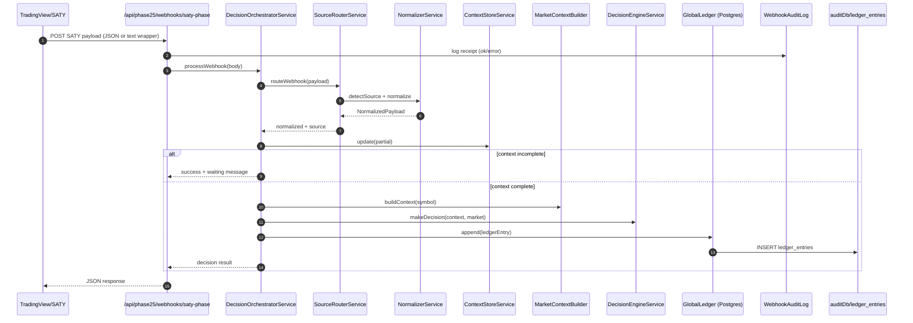
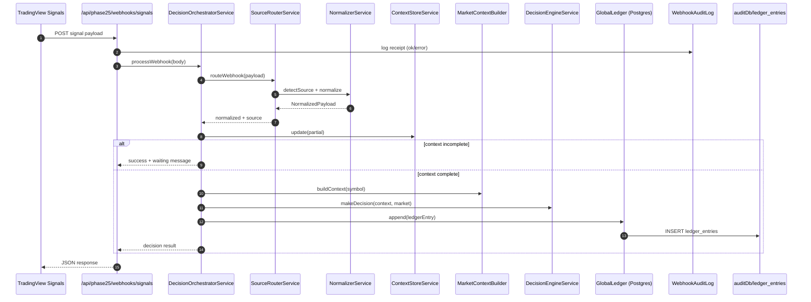
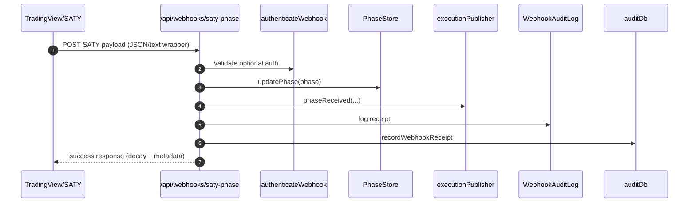
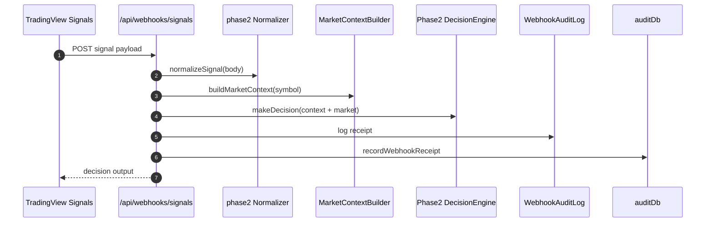
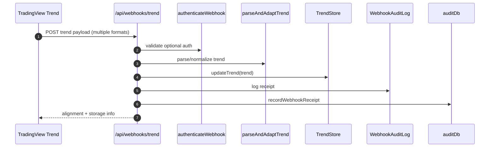

# Phase 2.5 Webhook Sequence Diagrams

These diagrams show the end-to-end flow for each webhook endpoint.

## 1) Phase 2.5 SATY Phase

## 2) Phase 2.5 Signals

## 3) Core SATY Phase (non‑Phase2.5)

## 4) Core Signals (Phase 2 engine)

## 5) Trend Webhook

