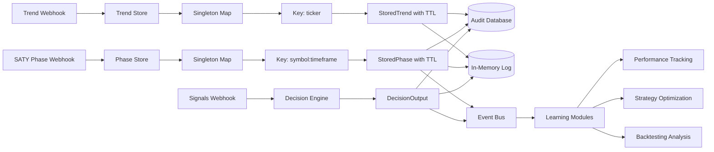
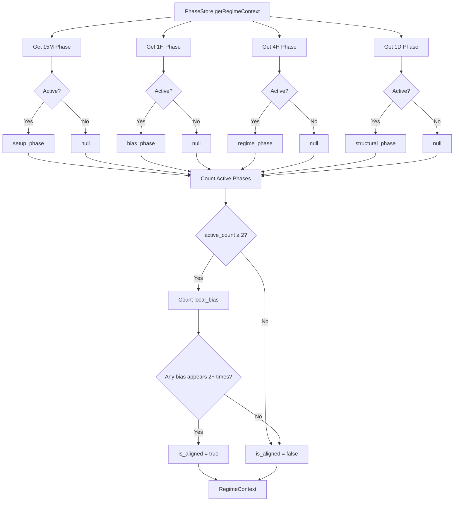
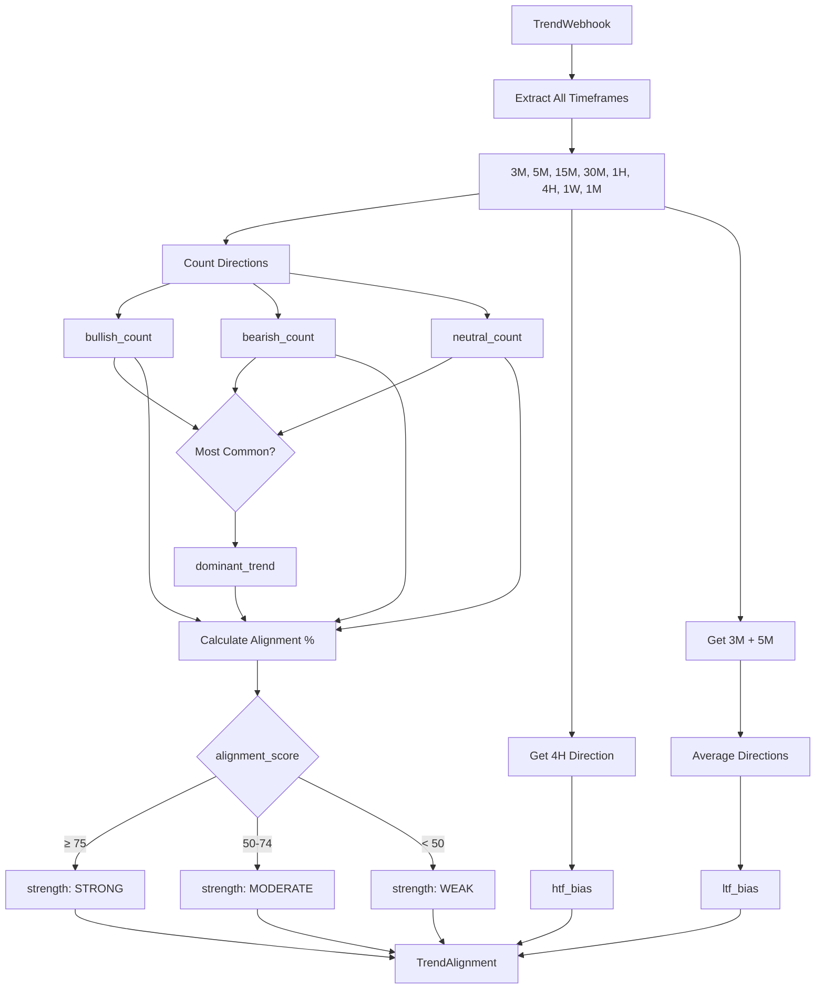
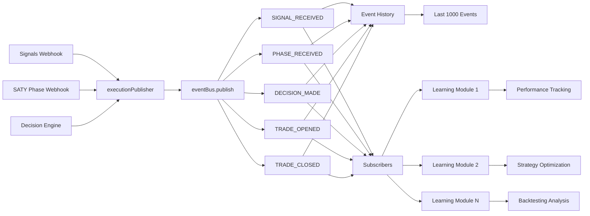

# Webhook Processing Flow Diagrams

## 1. Signals Webhook Flow

```mermaid
graph TD
    A[TradingView Alert] -->|HTTP POST| B[/api/webhooks/signals]
    B --> C{Authentication}
    C -->|Optional| D[Capture Headers & Body]
    D --> E{JSON Valid?}
    E -->|No| F[HTTP 400: Invalid JSON]
    E -->|Yes| G[Normalizer.normalizeSignal]
    
    G --> H{Validation}
    H -->|Fail| I[HTTP 400: Validation Error]
    H -->|Pass| J[MarketContextBuilder]
    
    J --> K[Fetch Tradier Data]
    J --> L[Fetch TwelveData]
    J --> M[Fetch Alpaca Data]
    
    K --> N[Merge Market Context]
    L --> N
    M --> N
    
    N --> O[DecisionEngine.makeDecision]
    
    O --> P[Evaluate SPREAD_GATE]
    P --> Q[Evaluate VOLATILITY_GATE]
    Q --> R[Evaluate GAMMA_GATE]
    R --> S[Evaluate PHASE_GATE]
    S --> T[Evaluate SESSION_GATE]
    
    T --> U{All Gates Pass?}
    U -->|Yes| V[Decision: ACCEPT]
    U -->|No| W[Decision: REJECT]
    
    V --> X[Calculate Confidence]
    X --> Y[Build Audit Trail]
    W --> Z[Collect Rejection Reasons]
    Z --> Y
    
    Y --> AA[recordWebhookReceipt]
    Y --> AB[WebhookAuditLog.add]
    Y --> AC[eventBus.publish DECISION_MADE]
    Y --> AD[HTTP 200: DecisionOutput]
    
    AA --> AE[(Database)]
    AB --> AF[(In-Memory Log)]
    AC --> AG[Event Bus]
    AG --> AH[Learning Modules Subscribe]
```

## 2. SATY Phase Webhook Flow

```mermaid
graph TD
    A[TradingView Alert] -->|HTTP POST| B[/api/webhooks/saty-phase]
    B --> C{Authentication}
    C -->|Optional| D[Capture Headers & Body]
    
    D --> E{Contains 'Trend Change:'?}
    E -->|Yes| F[HTTP 400: Wrong Endpoint]
    E -->|No| G{Has 'timeframes' field?}
    G -->|Yes| H[HTTP 400: Wrong Endpoint]
    G -->|No| I[Try Parse: Text-Wrapped]
    
    I --> J{Success?}
    J -->|No| K[Try Parse: Direct SATY]
    J -->|Yes| M[Phase Validated]
    
    K --> L{Success?}
    L -->|No| N[Try Parse: Flexible Adapter]
    L -->|Yes| M
    
    N --> O{Success?}
    O -->|No| P[HTTP 400: Invalid Payload]
    O -->|Yes| M
    
    M --> Q[Calculate Decay Time]
    Q --> R[PhaseStore.updatePhase]
    
    R --> S[Store with TTL]
    S --> T[Key: symbol:timeframe]
    T --> U[Cleanup Expired Phases]
    
    U --> V[PhaseStore.getRegimeContext]
    V --> W[Aggregate 15M/1H/4H/1D]
    W --> X[Calculate Alignment]
    
    X --> Y[executionPublisher.phaseReceived]
    Y --> Z[recordWebhookReceipt]
    Z --> AA[WebhookAuditLog.add]
    AA --> AB[HTTP 200: Success Response]
    
    Y --> AC[Event Bus]
    AC --> AD[Learning Modules Subscribe]
    Z --> AE[(Database)]
    AA --> AF[(In-Memory Log)]
```

## 3. Trend Webhook Flow

```mermaid
graph TD
    A[TradingView Alert] -->|HTTP POST| B[/api/webhooks/trend]
    B --> C{Authentication}
    C -->|Optional| D[Capture Headers & Body]
    
    D --> E{Has 'text' field?}
    E -->|Yes| F[Try Parse: Legacy Wrapper]
    E -->|No| G[Try Parse: TradingView Format]
    
    F --> H{Success?}
    H -->|No| I[HTTP 400: Invalid Payload]
    H -->|Yes| J[Trend Validated]
    
    G --> K{Success?}
    K -->|No| L[Try Parse: Canonical Format]
    K -->|Yes| J
    
    L --> M{Success?}
    M -->|No| I
    M -->|Yes| J
    
    J --> N[TrendStore.updateTrend]
    N --> O[Store with 1-hour TTL]
    O --> P[Key: ticker]
    P --> Q[Cleanup Expired Trends]
    
    Q --> R[calculateTrendAlignment]
    R --> S[Count Bullish/Bearish/Neutral]
    S --> T[Determine Dominant Trend]
    T --> U[Calculate HTF Bias 4H]
    U --> V[Calculate LTF Bias 3M+5M]
    V --> W[Calculate Alignment Score]
    W --> X[Determine Strength]
    
    X --> Y[recordWebhookReceipt]
    Y --> Z[WebhookAuditLog.add]
    Z --> AA[HTTP 200: Success Response]
    
    Y --> AB[(Database)]
    Z --> AC[(In-Memory Log)]
```

## 4. Data Storage Architecture



## 5. Decision Engine Gate Evaluation

```mermaid
graph TD
    A[DecisionContext] --> B[SPREAD_GATE]
    B --> C{spreadBps ≤ 12?}
    C -->|No| D[FAIL: SPREAD_TOO_WIDE]
    C -->|Yes| E[PASS]
    
    E --> F[VOLATILITY_GATE]
    F --> G{putCallRatio ≤ 2.0?}
    G -->|No| H[FAIL: VOLATILITY_TOO_HIGH]
    G -->|Yes| I[PASS]
    
    I --> J[GAMMA_GATE]
    J --> K{Gamma Aligns?}
    K -->|No| L[FAIL: GAMMA_BIAS_UNFAVORABLE]
    K -->|Yes| M[PASS]
    
    M --> N[PHASE_GATE]
    N --> O{|phase| ≥ 65?}
    O -->|No| P[FAIL: PHASE_CONFIDENCE_LOW]
    O -->|Yes| Q{Phase Aligns?}
    Q -->|No| R[FAIL: PHASE_MISALIGNMENT]
    Q -->|Yes| S[PASS]
    
    S --> T[SESSION_GATE]
    T --> U{session != AFTERHOURS?}
    U -->|No| V[FAIL: SESSION_NOT_ALLOWED]
    U -->|Yes| W[PASS]
    
    D --> X[Decision: REJECT]
    H --> X
    L --> X
    P --> X
    R --> X
    V --> X
    
    W --> Y{All Gates Passed?}
    Y -->|Yes| Z[Decision: ACCEPT]
    Y -->|No| X
    
    Z --> AA[Calculate Confidence]
    AA --> AB[Base: aiScore]
    AB --> AC{|phase| ≥ 80?}
    AC -->|Yes| AD[+0.5 boost]
    AC -->|No| AE{spreadBps ≤ 5?}
    AD --> AE
    AE -->|Yes| AF[+0.3 boost]
    AE -->|No| AG[Final Confidence]
    AF --> AG
    AG --> AH[Cap at 10.0]
```

## 6. Phase Store Regime Context



## 7. Trend Alignment Calculation



## 8. Event Bus Pub/Sub Pattern



---

## Legend

- **Rectangle**: Process/Function
- **Diamond**: Decision Point
- **Cylinder**: Data Storage
- **Parallelogram**: Input/Output
- **Rounded Rectangle**: Start/End
- **Solid Arrow**: Data Flow
- **Dashed Arrow**: Optional Flow

---

**Generated:** January 14, 2026
**Purpose:** Visual documentation of webhook processing flows
